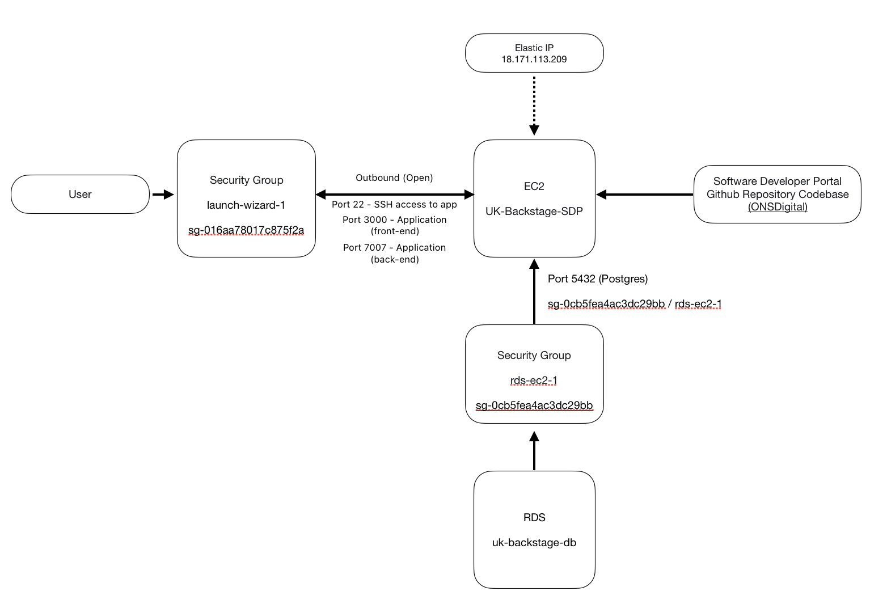

# AWS deployment

This part of the documentation will cover how the SDP is currently deployed in AWS and the future developments. 

## Current SDP cloud configuration


### Architecture Diagram

The following shows the current architecture for the SDP.



### Architecture Overview

The current deployment of the SDP (Service Delivery Platform) is conducted manually without any automation, as it remains in its Proof of Concept (PoC) phase.

### Manual Cloning and Deployment
The SDP is manually cloned into the EC2 instance (UK-Backstage-SDP) from the ONSDigital repository [ONSDigital/sdp-backstage](https://github.com/ONSdigital/sdp-backstage). This process involves accessing the EC2 instance and executing Git commands to pull the latest codebase.

### Accessing the EC2 Instance
To access the EC2 instance, there are two primary methods:

1. Amazon Cloud Console: Utilize the AWS Management Console to interact with the EC2 instance.
2. Integrated Development Environment (IDE): Use your preferred IDE with SSH access. It is crucial to have the corresponding .pem file on your machine to establish a secure connection.

Note - to access the EC2 instance you will need the pem file associated with the ec2 instance, you will be able to find it in the AWS secret manager.

### Elastic IP Address
The EC2 instance is assigned an elastic IP address. This ensures that the instance retains a static IP address, even if it is stopped or restarted, providing consistency for accessing and managing the instance.

### Database Integration
The EC2 instance is linked to an RDS database (uk-backstage-db) which handles all the application's database operations. This integration is facilitated through a security group (rds-ec2-1) that connects the two services securely.

Note: To ensure seamless operation of the RDS database with Backstage, verify that the database environment variables are accurately set and exported. These variables should be correctly referenced in the app-config.yaml file to allow Backstage to successfully locate and interact with the database.
```
#example
      host: ${BSTAGE_DATABASE_ENDPOINT}
      port: 5432
      user: postgres
      password: ${BSTAGE_DATABASE_PASSWORD}
```

## Future developments of the AWS infrastructure

The following shows a proposed architecture for delivering containerised services using AWS ECS Fargate.


### Architecture Overview

### Public and Private Subnets
The AWS network is segregated into a Public and Private subnet.  Separating resources that are publicly accessible from those resources that do not require access publicly is a more secure and cost effective pattern:

Reducing the attack service for those resources that do not need a public IP address limiting potential security risks. 
Reducing data transfer costs since the private subnet can communicate and exchange data with any other resources in the same AWS VPC for free, whereas exchanges between different VPCs are usually charged.

### SSL Custom Domain, SSL Certificate and ALB Rules
AWS Certificate Manager, Route 53 DNS and rules at the Application Load Balancer are used to ensure access to the application is only allowed over a https/TLS connection which is encrypted, therefore traffic between the browser and the web cannot be read by an attacker.

AWS Certificate Manager authenticates the endpoint so that the end user is sure that they are communicating with the legitimate website and not a site impersonating the endpoint.

Route 53 maps incoming web requests to the application load balancer using a DNS Alias record.

An appropriate rule at the Application Load Balancer redirects any traffic on port 80 (http) to port 443 (https)

### Web Application Firewall
This is a series of rules and access control lists that are applied to incoming traffic so that any requests that do not meet set requirements can be rejected. 

All traffic is blocked by default and only traffic matching a defined rule is allowed through to the Application Load Balancer.

IP sets can be created so that services can be restricted to only on-net or on-ons-vpn devices or specific ip addresses.

Rule groups allow a combination of rules to be applied, the rules can pattern match on elements of the request (e.g the host header) and apply an ip set as a filter. This allows you to define that access to newservice.sdp-sandbox.aws.onsdigital.uk is only reachable from an on-net/ons-vpn device.

### Application Load Balancer
An Application Load Balancer is staged in the public subnet and fronts the backend services.  This is the central point for serving any traffic from the internet. The load balancer allows scaling of backend services, providing the ability to distribute traffic to multiple end points as demand grows. 

A security group is applied at the load balancer to ensure nonsecure traffic is redirected to port 443 to ensure only https traffic is allowed.

As it is the central point for incoming traffic it is also the place where rules can be added to ensure that Cognito authentication is required based on the endpoint the request is destined for.

This allows you to define that if the host header includes newservice.sdp-sandbox.aws.onsdigital.uk then the request must be authenticated with Cognito before being forwarded to the backend service.

### Cognito
Authentication to services is provided by AWS Cognito.  This service allows authentication to be implemented using standard practices with proven code all managed by the AWS identity provider which supports sign-up, password complexity, password reset and and forgotten password functionality out of the box.

User groups can be configured to allow sign up to an application via email, users in these user groups are then authenticated at the Application Load Balancer when requests are made to the protected service.

Notes: 

1. Cognito can be integrated with Azure Active Directory to allow SSO authentication (access) to applications.  This pattern has been proven by SPP User Management but is ToDo for the above architecture.
2. Cognito and Azure Active Directory can also be used to provide a layer of authorisation to allow different users different levels of access in a given application (e.g role based access control).  This pattern has also been proven by SPP User Management but is ToDo for the above architecture.

### Target Group
A target group is a logical mapping that allows the Application Load Balancer to map received traffic to an end service.  Initially there is a single target group that is applied in a forwarding rule at the load balancer and the same target group is associated with an ECS service.

This logical mapping between ALB forwarding rules and Services will allow multiple services to be configured on the same load balancer and the traffic distributed accordingly based on the provisioned target groups.

### NAT Gateway
A NAT Gateway, hosted in the public subnet, allows any services that are in the private subnet to route traffic to the public internet without exposing the ip address of the private resource ensuring that external actors cannot obtain information that could compromise the solution.

### Elastic Container Service
This AWS service comprises a number of resources that together allow containerised applications to be spun up and activated without the need to manage any underlying resources.

A security group is defined at the service level which restricts traffic to only come from the application load balancer and expect traffic on specific ports (e.g to map traffic from the load balancer received on port 80 to the internal container port, e.g 8501 for default Streamlit port).

Based on a task definition profile AWS will load a specified container image, monitor the application and ensure that a minimum number of tasks are always running, this enables auto healing when a task develops a fault as AWS will immediately detect and spin up a new instance.

The ability to grow and shrink tasks based on demand will enable the SDP to scale to meet traffic and should reduce costs as instances are allocated only as and when they are needed.

Deployment requirements can be specified that ensure a minimum of one instance of the service is available when a new deployment is being made, this allows a rolling update with zero down time to users. The deployment will spin up the new container image in a new task, wait for it to become active and then dry up and remove the task running the previous container image.

If multiple different services need to be supported, this can be achieved simply by defining a new service, task definition and target group appropriate to the new service.

### Elastic Container Registry
The Elastic Container Registry (ECR) service acts like Docker Hub, providing a central store for containerised application images. The developer makes changes to application code locally, builds a docker image and then uploads this image to ECR.  A centralised store for container images allows for consistent deployments as all image versions are stored and deployed from a single location and can provide extra security by scanning images for known vulnerabilities.

Amazon ECR also integrates easily with other AWS services simplifying deployment.

