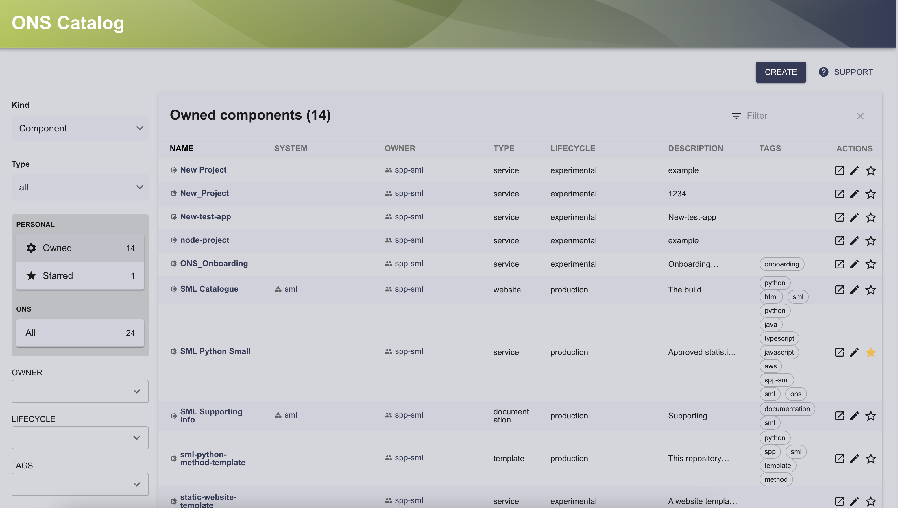
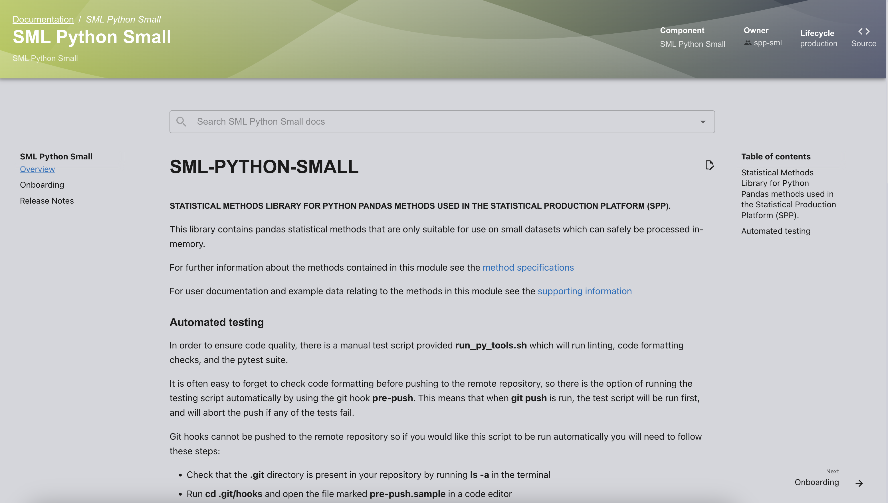
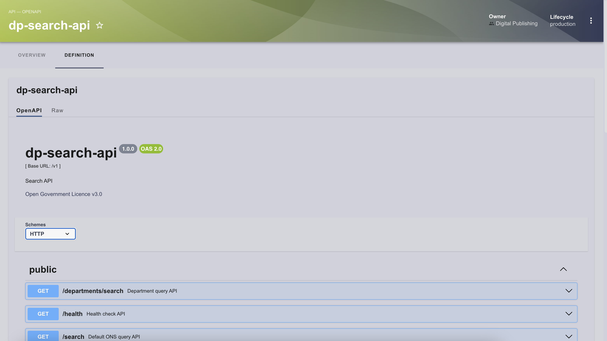
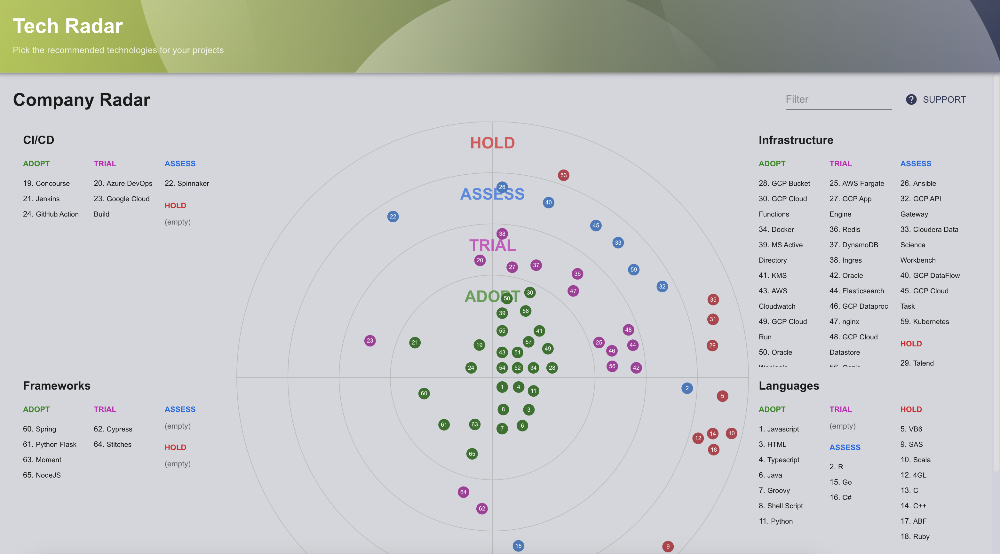

# Core Features

## Software Catalog

The catalog serves as a comprehensive repository for tracking various components within Backstage, which is one of its core functionality. Examples of catalog items include GitHub repositories, documentation sites, cloud resources, teams, and team members. Backstage exhibits flexibility in accommodating a wide array of components relevant to software development projects.

By storing this information within Backstage, it provides a clear view of any information that might be relevant to a project. This includes how components of projects fit together, who is responsible for what, open pull requests, cloud resource health, etc. Most of the rest of Backstage revolves around this information and making clever use of it.

Open-source plugins from the community can provide additional functionality to the Catalog by integrating with external services and pulling in relevant data from them. See SDP: [Integrations](./integrations.md) for some examples. 

Catalogue entities are defined using YAML files. Typically these will reside in thier project repositories but they can also be entered directly into the database without a YAML file having to actually exist somewhere external to Backstage (this is how certain integrations automatically "discover" users into the catalogue.

## Software Templates

Software templates are essentially a set of instructions which tell Backstage to execute a series of actions with certain user inputs. This is a highly flexible system which can be adapted into a large range of use-cases. 

For example:

- Creating a fresh repository for a Python project, with best-practice configurations already set, project structure according to standards, tests and CI already running and documentation skeleton included.

- Provisioning an S3 bucket in AWS and automatically configuring it for web hosting, then uploading a template for a website to it.

- Converting Confluence documentation into Markdown, then uploading it to a repository to be viewable within Backstage.

Templates are YAML files which consist of three main parts:

- Parameters - determining the user inputs to the template. Backstage automatically produces the user input interface from these parameters.

- Steps - determining the actions the template should take based on the parameters. A set of default actions is included within Backstage - additional actions can be installed using plugins, or written yourself. 

    See the page on writing custom template actions [here](./template_actions.md).

    A typical flow could involve using fetch:template to move (and replace variables for) files into the workspace, then using a publish action to put them somewhere.

    Note - that templates are commonly stored alongside a "content" or "skeleton" folder, from which the files intended for templating are fetched. Alternatively, templates can also be sourced directly from a template repository using its URL. The execution of steps within templates can be made conditional based on the values of variables sourced from the parameters stage.

- Output - determining what the user should see once the actions have completed.

Templates, like most things in Backstage, are entities. This means that they are loaded into the catalog like anything else. However, as long as you don't need dynamic addition/removal of templates, they can reasonably be included using static configuration (manually pointed to in Backstage's app-config.yaml). Note that this is infeasible for most entities.

Backstage provides some example templates, which can be found in the official [repository](https://github.com/backstage/software-templates). However, it appears that community-published templates are scarce, contrary to what one might expect. 

This scarcity suggests that the primary approach to sourcing templates is for them to be created on an as-needed basis by the internal team managing the platform. This approach is likely due to the fact that different organizations have significantly varied requirements and integrations, necessitating customized solutions.

### Automatic Repo Configuration

Since we want newly created repos to follow best practices, we want them to have configuration options like branch protection already enabled. Here's how a few of them ended up:

- Branch protection: implemented using Scaffolder actions, only available on public repos (or repos owned by accounts with GitHub Pro).

- Security scanning: GitHub security scanning is only available for public repos, or repos on GitHub Enterprise. You can also use an alternative method using Bandit which automatically checks for security issues via GitHub Actions.

- Secret scanning: GitHub secret scanning is only available for public repos, or repos on GitHub Enterprise.

- Dependabot: The Dependabot section of the GitHub API is still in public beta; there's no endpoint for enabling Dependabot that I could find (although there are a few for interacting with it). Might be worth failing the CI checks until Dependabot is enabled?

## TechDocs

TechDocs is Backstage's integrated documentation-as-code solution, built on top of MkDocs.

The primary advantage of this approach is the seamless integration between documentation and software, making both easily accessible and maintainable. Another significant benefit is the simplicity and speed of writing documentation in Markdown, which renders in a highly presentable format.

To utilize TechDocs, documentation must be written in Markdown. The backstage.io/techdocs-ref configuration must be set in app-config.yaml to point to a directory containing the documentation folder, which is named "docs" by default. Additionally, a mkdocs.yaml file must be present in the same directory to define the structure of the documentation, as detailed in the MkDocs documentation.

For optimal integration, it is recommended to locate the documentation alongside the code. This enhances visibility within Backstage and encourages developers to keep the documentation up to date.

In cases where a single documentation site needs to cover multiple repositories or projects (e.g., both sml-python-small and statistical-methods-library), a standalone repository may be preferable. Projects in Backstage can link to the external documentation by setting backstage.io/techdocs-ref in their respective app-config.yaml files to url:<url-to-standalone-docs-folder> instead of the default 'dir:..'.

There are a few nuances to note:

1. The root page must be named index.md.
2. The integrated search bar only appears when viewing the created documentation entity, not when viewing the "docs" tab in the original entity.

This structured approach ensures that documentation remains closely linked with the codebase, promoting better maintenance and accessibility.

## API documentation

Backstage offers a plugin that provides a robust "API explorer" interface, enabling users to list endpoints, view descriptions, and even generate requests directly from within Backstage. To utilize this feature, an entity must be defined as an API in its catalog-info.yaml file, with the API definition provided under the spec.definition key. Backstage supports three formats for these definitions: OpenAPI, AsyncAPI, and GraphQL.

## Tech Radar

Backstage's integrated Tech Radar allows organisation managers to outline best practices when it comes to technology adoption. By nature, this should be manually curated (assigning HOLD/ASSESS/TRIAL/ADOPT) but some aspects may be dynamically populated using information from a variety of sources. The SDP uses project data to link technologies to the projects which use them.

To populate the radar, data is served from a given client implementing the TechRadarApi interface - this means that you can provide your own source of data and that updating the radar does not require a change to the source of the Backstage frontend. Although complex implementations are possible, it is just as reasonable to read the radar information straight from a JSON file on disk.

For further information, regarding how the tech radar is customised or how the project data is inserted into the SDP tech radar click [here](tech_radar_customisation.md).

## Theming and UI

Backstage is a React app, which means that the frontend is highly customisable. There has been a small colour change using some of the ONS colours and the demo custom theme provided by Backstage. Custom themes are made by passing configuration options to a theme-creator method, where you can change any of the common colours, fonts and shapes used across the app.

More advanced customisation is possible through directly editing the React source under packages/app. This provides full control over the frontend of Backstage; for example, you could add or remove elements from the sidebar, or construct a landing page for easier navigation.