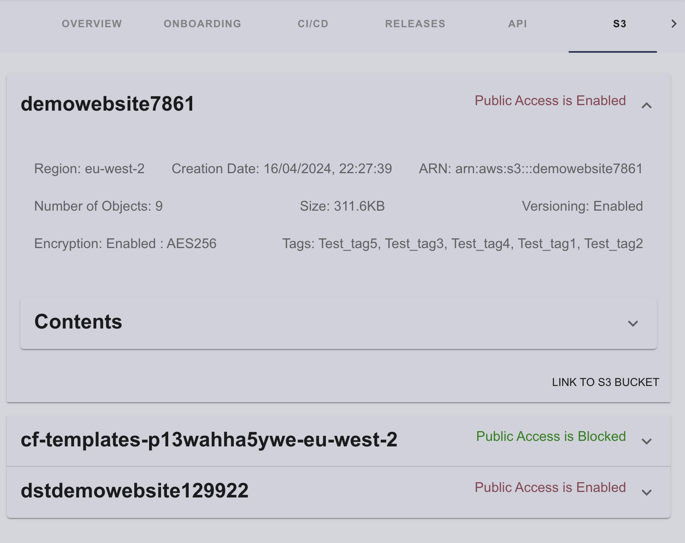
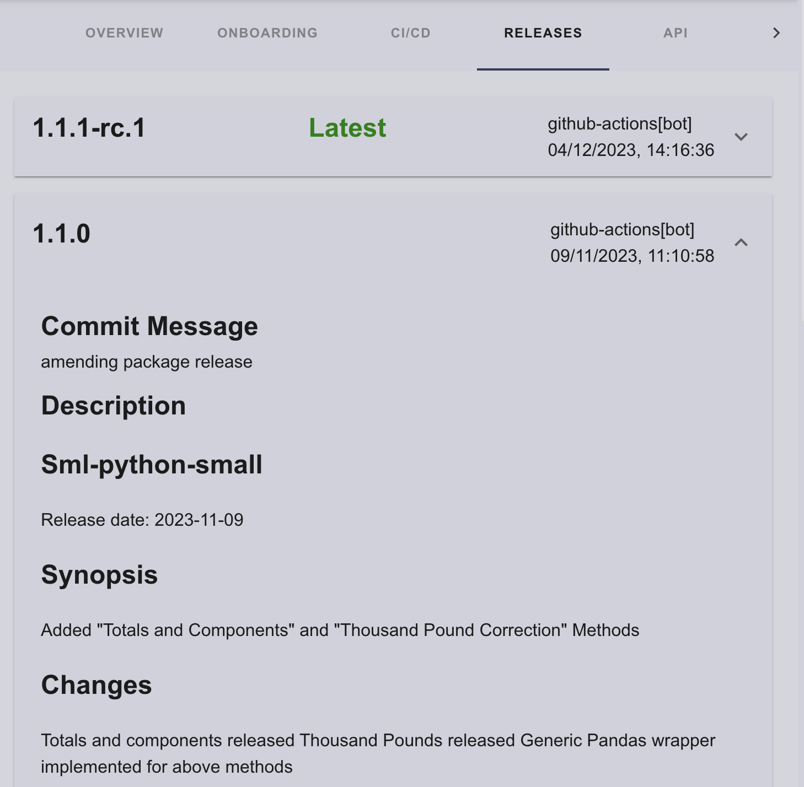

# Custom Plugins

This part of the documentation will cover creation of a basic backstage plugin and plugins that have been developed and are currently used by the SDP.

## Create a Plugin

To create a new frontend plugin, make sure you've run `yarn install` and installed dependencies, then run the following on your command line (a shortcut to invoking the backstage-cli new --select plugin) from the root of your project.

`yarn new --select plugin`


This will create a new basic front end Backstage Plugin template based on the ID that was provided. It will be built and added to the Backstage App automatically. From here you are able to develop the plugin in any way you want.

### Other Plugin Library Package Types

There are other plugin library package types that you can chose from. To be able to select the type when you create a new plugin just run: `yarn new`. You'll then be asked what type of plugin you wish to create like this:


For a more extenisve documentation on plugin development in backstage click this [link](https://backstage.io/docs/plugins/).


## Plugins developed for the SDP 


## AWS S3 Bucket Plugin

This plugin was developed to display associated S3 buckets with the catalog component.



The plugin was created using the yarn create command to template basic plugin environments for both the front-end and the backend.

For the initial setup to connect the front-end and backend, the development followed this [tutorial](https://john-tucker.medium.com/backstage-plugins-by-example-part-1-a4737e21d256).


The primary development of the plugin was conducted in the routes.ts file in the backend, utilizing the AWS SDK to retrieve the necessary information from the associated AWS account.

The code in route.ts sets up an Express router to interact with AWS S3, enabling the retrieval of various bucket-related data. 

Here's a concise summary:

### Imports and Interface Definition:

Imports express, winston (for logging), @backstage/config (for configuration), and aws-sdk.
Defines RouterOptions interface including config and logger.

### Router Creation:

createRouter function initializes AWS SDK with credentials and region from the configuration.
Creates an S3 client instance.
Sets up an Express router with a /health endpoint to fetch and return bucket data.

### AWS SDK Configuration:

Configures AWS SDK using credentials (accessKeyId, secretAccessKey) and region specified in the configuration file.

### Health Check Endpoint:

Defines a /health endpoint that fetches and responds with bucket data.
Logs errors and returns a server error response if data fetching fails.

### Bucket Data Functions:

Asynchronous functions fetch specific S3 bucket data:

- getBucketRegions: Retrieves bucket regions.
- getBucketVersioningStatus: Checks versioning status.
- getBucketObjects: Lists objects.
- getBucketTags: Fetches tags.
- isBucketPublic: Determines public accessibility.
- getBucketSize: Calculates total object size.
- getCreationDate: Gets creation dates.
- getBucketEncryptionStatus: Checks encryption status.
- getBucketEncryption: Retrieves encryption types.

Fetching All Bucket Data:

- fetchBucketData function combines results from Bucket Data functions to provide comprehensive bucket data.

### Associating AWS Account

To associate an AWS account with the portal and the S3 viewer plugin, a new integration was added to app-config.yaml as shown below:

```
integrations:
  s3viewer:
    accessKeyId: ${AWS_ACCESS_KEY_ID}
    secretAccessKey: ${AWS_SECRET_ACCESS_KEY}
    sessionToken: ${AWS_SESSION_TOKEN}
```

The IDs and secrets are subsequently pulled and applied to the AWS configuration to ensure that the plugin obtains the required account information to associate the AWS account.

```
  AWS.config.update({
    region: 'eu-west-2',
    apiVersion: 'latest',
    accessKeyId: config.getString('integrations.s3viewer.accessKeyId'),
    secretAccessKey: config.getString('integrations.s3viewer.secretAccessKey'),
  });
```

### Frontend UI development

Once the backend development was finalized, the focus shifted to the frontend development. The primary objectives were to ensure that the frontend plugin could successfully make API calls to the backend, retrieve all necessary data, and generate a user interface to display this data effectively.

The frontend implementation involved the following key tasks:

- API Integration: Establishing a robust mechanism for the frontend plugin to communicate with the backend API, ensuring reliable data retrieval.

- Data Handling: Efficiently processing and managing the data received from the backend to prepare it for presentation.

- UI Development: Designing and developing a user-friendly interface to display the data. This involved using backstage's Material-UI components to create a custom component called 'Tab' which aligned with the overall design principles of the application.

### S3 association with catalog component

The S3 reasurces can be associated with a component by using the resource names in the component's catalog-info.yaml file located in its repository and inputing them under the cloud/bucket annotation, like so: 

```
# example
apiVersion: backstage.io/v1alpha1
kind: Component
metadata:
  name: Software-Developer-Portal
  description: Software Developer Portal
  annotations:
    jira/project-key: SPP
    github.com/project-slug: ONS-Innovation/Software-Developer-Portal
  tags:
    - app
    - spp
///
cloud:
    provider: "AWS"
    buckets: demowebsite7861, cf-templates-p13wahha5ywe-eu-west-2, dstdemowebsite129922
///
spec:
  type: app
  lifecycle: production
  owner: user:default/wojciechp-ons
```

Note: the provider is set to 'AWS' for the time being as this is a PoC plugin and for further development it could include other providers such as GCP and Azure.


## GitHub Releases Plugin

This plugin was developed to display catalog component's github repository releases. 



The plugin was created using the yarn create command to template basic plugin environments for both the front-end and the backend.

For the initial setup to connect the front-end and backend, the development followed this [tutorial](https://john-tucker.medium.com/backstage-plugins-by-example-part-1-a4737e21d256).

The primary development of the plugin was conducted in the routes.ts file in the backend, utilizing the Github's API to retrieve the necessary information from the associated repositories.

The backend plugin sets up an Express router to interact with GitHub's API to fetch release data from repositories. 

Here's a concise summary for it:

### Imports and Router Setup:

Imports express, @backstage/config, @octokit/auth-app, and @octokit/request.
Creates an Express router instance.

### Interface Definition:

Defines RouterOptions interface containing a simplified logger and a configuration object.

### Release Interface:

Defines Release interface to structure release data.

### Router Creation Function:

createRouter function sets up a /health endpoint.

The endpoint requires repository and owner query parameters.

Logs the request and validates parameters.

Calls fetchReleases to get release data and responds with the data or an error message.

### GitHub App Authentication:

Configures GitHub App authentication using createAppAuth with credentials from environment variables.

### Access Token Function:

getInstallationAccessToken function retrieves an installation access token using the GitHub App credentials.

Calls getInstallationId to fetch the installation ID from environment variables.

### Fetch Releases Function:

fetchReleases function fetches release data from a specified GitHub repository.

Uses the access token for authenticated requests.

Fetches the latest tags and commit messages for each release.

Logs relevant information and errors.

### Environment Variables:

Requires the following environment variables:

```
GITHUB_APP_ID

GITHUB_APP_PRIVATE_KEY

GITHUB_APP_CLIENT_ID

GITHUB_APP_CLIENT_SECRET

GITHUB_APP_INSTALLATION_ID
```

These environment variables are associated with the GitHub App credentials.

### Repository Parameters:

The repository parameters are retrieved using a hook in the front end plugin 'useReleasesObjects.ts' 

- repositoryName

`const repositoryName = entity?.metadata?.name;` 

fetches the repositoryName parameter from the entity's catalog-info.yaml located in its repository.

- ownerName

`  const ownerName = "ONSDigital"`

the ownerName parameter is currently hard-coded as 'ONSDigital' due to the SDP not being deployed in the ONSDigital org as of yet and it allows to showcase the potenital of the PoC, once the app is deployed in ONSDigital there is an available piece of code to replace the current workaround:

```
// Use the following code to extract the owner name from the project slug annotation
  // const projectSlug = entity?.metadata?.annotations?.['github.com/project-slug'];
  // const ownerName = projectSlug ? projectSlug.split('/')[0] : undefined;
``` 

### Frontend UI development

Once the backend development was finalized, the focus shifted to the frontend development. The primary objectives were to ensure that the frontend plugin could successfully make API calls to the backend, retrieve all necessary data, and generate a user interface to display this data effectively.

The frontend implementation involved the following key tasks:

- API Integration: Establishing a robust mechanism for the frontend plugin to communicate with the backend API, ensuring reliable data retrieval.

- Data Handling: Efficiently processing and managing the data received from the backend to prepare it for presentation.

- UI Development: Designing and developing a user-friendly interface to display the data. This involved using backstage's Material-UI components to create a custom component called 'card' which aligned with the overall design principles of the application.