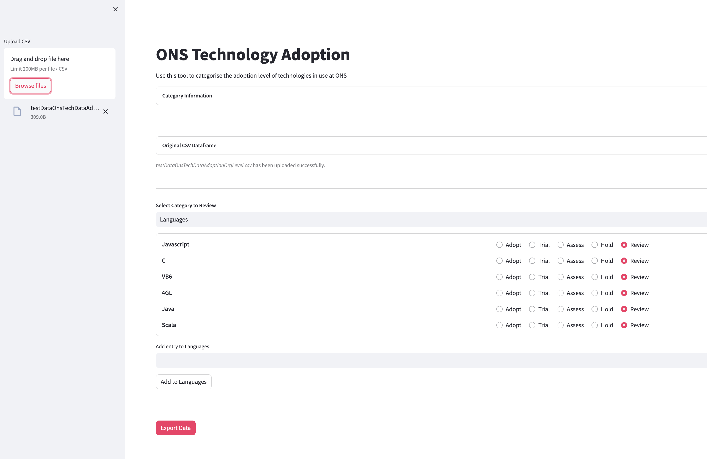

# Tech Radar Customisation

The Tech Radar is a frontend plugin which works out the box as part of basic Backstage set up. You might notice that the only reference to the Tech Radar in code is when it's mentioned in as a TechRadarPage in packages/app/src/App.tsx. This is because all of its code is neatly packaged inside the plugin and not part of Backstage's source.

You should be able to find the plugin's code in the node module folder - node_modules/@backstage/plugin-tech-radar - alongside the code for all the rest of the installed plugins. 

- Note: Be careful, though - these files are handled by yarn and npm, so any changes you make won't survive a yarn install. If you do need to make changes to a plugin's code, you should copy its source to a folder and create a new plugin using [these instructions](./custom_plugins.md).

## Custom API

Although it's possible to change the Tech Radar as above, all we really need to do to make use of it, is to provide our own API. Essentially, there's a TechRadarApi interface that is required to implement and fill with data.

You can create a new file somewhere nearby - (For the SDP we created a tech_radar folder next to components but it doesn't really matter where you put it) and start structruing it as shown below:

```ts
 
import {
    TechRadarApi,
    TechRadarLoaderResponse,
    RadarEntry,
    RadarEntryLink,
} from '@backstage/plugin-tech-radar';
 
export class OnsRadar implements TechRadarApi {
    async load(id: string | undefined): Promise<TechRadarLoaderResponse> {
        // ...
    }
}
```

Inside the load function, we want to return the information that the Tech Radar should display. The structure of this is defined by the TechRadarLoaderResponse.

While building the loader response, we can fill it with any data we like (For the SDP we are using the project information to showcase the tech usesage within the org). For now the data is hard-coded, but could implement dynamic updates in future iterations, but this would require further investigation.

## Actually using the API

The next step is to tell Backstage about our API.

In packages/app/src/apis.ts you can find an exported a list of AnyApiFactory objects under the name apis. To change the Tech Radar API from its default example state, we're going to overwrite the reference:

```ts
// ...
 
import { OnsRadar } from './tech_radar/onsRadarClient'; // or whatever you called it
import { techRadarApiRef } from '@backstage/plugin-tech-radar';
 
export const apis: AnyApiFactory[] = [ // note that this is a list, not a function! if you're getting a syntax error, it might be because you're not using commas to separate the items
    // ... other apis...
    createApiFactory(techRadarApiRef, new OnsRadar()),
];
```

The Tech Radar should now display the data you have added. 

## Software Developer Portal Tech Radar Converter

A basic tool (tech_adoption_ui) was developed to convert CSV data set into JSON format. This tool was designed to process a CSV file that details the technologies adopted by each project within ONS and lets you categorise it into the seperate adoption sections 'HOLD/ASSESS/TRIAL/ADOPT'. 

The tool takes the data from the CSV file and formats it into a JSON structure, which is subsequently used by the SDP.



The tool is located [here](https://github.com/ONSdigital/sdp-tech-radar-json).


## Updating Data

To update the Tech Radar with the most current data, place the newly generated JSON file in the following directory: /packages/app/public/tech_radar, naming it onsRadarSkeleton.json. Once the file is in this location, the updated data will automatically render on the page.

Here are useful files:

- [Full Clean JSON](https://confluence.ons.gov.uk/display/SEC/Tech+Radar+customisation?preview=/173121507/190820211/onsRadarV2.json)
- [Full CSV](https://confluence.ons.gov.uk/display/SEC/Tech+Radar+customisation?preview=/173121507/190820008/onsTechDataAdoption.csv)

 