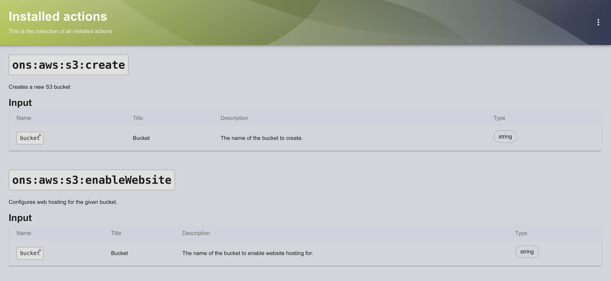

# Template actions

This page will serve as a useful intro to writing your own template actions as part of Backstage.

## Introduction
The component of Backstage responsible for managing templates is known as the Scaffolder. Although it is technically a plugin, it comes pre-installed with Backstage. The Scaffolder is part of the backend, and the relevant code is located in packages/backend/src/plugins/scaffolder.ts.

Within the scaffolder.ts file, there is a function called createPlugin. This function initializes the Scaffolder plugin, enabling the creation of custom actions.
```ts
export default async function createPlugin(
  env: PluginEnvironment,
): Promise<Router> {
 // ...
}
```

In the lower section of the function, there is a line declaring const builtInActions = createBuiltinActions(...). If you are using VSCode or a similar IDE, hovering over this function should display its return type, which is an array of TemplateAction.

The result of this function is then spread into the actions array using the ... operator. To create custom actions, a similar approach is employed, adding them to the end of this array.

## Creating Actions

It is important to note that Backstage has a dedicated page that lists all installed actions. This page can be accessed at the /create/actions endpoint, for example, http://localhost:3000/create/actions when running on localhost. This page will update as new actions are added.



To add new actions, create a function similar to the one shown below. While it can be placed in the scaffolder.ts file, it is recommended to organize it in a separate file for better maintainability. For instance, it can be placed in a folder named scaffolder and organized by type.

```ts
// you might need to add these if they aren't already present in the file you're working in
import { createTemplateAction } from '@backstage/plugin-scaffolder-node'
import { ScmIntegrations, DefaultGithubCredentialsProvider } from '@backstage/integration'
 
export const createXYZAction = () => {
    return createTemplateAction({
            // the action schema goes here - this is the object which describes the inputs and outputs of the action
            // have a look at either the existing actions or the ones I've added for an idea of what this looks like
        },
        async handler(ctx) {
            // this callback determines what the action actually does - you can put any code in here and it'll run when the action does
            // the ctx ("context") object contains a bunch of useful stuff for this:
 
            // - ctx.input contains the inputs you described in the schema object above. for example, ctx.input.repoUrl could have a GitHub URL that you use in the GitHub API
            //   this works because the type of ctx.input is JsonObject, so its keys are determined at runtime - just make sure the names match up between the schema and here
 
            // - ctx.output("key", $value) is a *function* which lets you set the output of the action.
            //   this isn't super commonly used unless you're making more complex actions, but it's good to know about
 
            // - ctx.logger carries the logger object for the scaffolder. this gives you access to methods like ctx.logger.info() and ctx.logger.error(), which print messages to the log
            //   the messages are visible both in the terminal window running backstage *and* inside the window that pops up while the template is running
            //   these functions are incredibly useful for debugging!
 
            // if you type "ctx." into VSCode, it should show you all of the object members that you can make use of as autocomplete options
        }
    )
}
```
Note - It can be useful to to make a basic action to get familiar with the process.

It is important to remember that template actions do not perform any tasks until they are incorporated into templates. Therefore, it is advisable to create an example template as well. 

However, ensure that the following step is completed first:

- Making the Actions Available
Now that an action has been created, it needs to be registered with Backstage. To do this, return to scaffolder.ts and import the function from the relevant file, for example, ./scaffolder/xyzActions or the appropriate name used.

    Next, add the newly created action to the list of actions:
    
    ```
    const actions = [
    ...builtInActions,
    // ...
    createXyzAction(),
    ];
    ```

    After completing this step, the new action should be visible at the /create/actions endpoint and ready to be used in templates.

